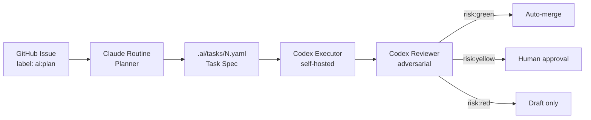

<div align="center">

# 🤖 AI Agent Delivery Pipeline

**Idea → Plan → Implement → Review → CI → Merge — fully wired through GitHub.**

[](https://github.com/alien-kai/ai-agent-delivery-pipeline)
[](https://www.anthropic.com/claude-code)
[](https://openai.com/index/openai-codex)
[](https://github.com/features/actions)
[](./LICENSE)
[](https://github.com/alien-kai/ai-agent-delivery-pipeline/pulls)
[](https://github.com/alien-kai/ai-agent-delivery-pipeline)

🌐 **Language**: **English** · [简体中文](./project/README.md)

</div>

---

## ✨ Motivation

LLM-based coding agents are powerful but **brittle when run end-to-end without guardrails**. Left alone, they refactor across the repo, skip tests, drift outside the requested scope, and merge code nobody fully understands. Most teams compensate with manual oversight — which erases the speed gain that pulled them to agents in the first place.

This repository is a **template for a guarded delivery pipeline** that treats AI agents as colleagues, not autopilots. It gives each agent one narrow role, uses GitHub as the source of truth and the state machine, and lets a risk policy decide what may merge itself versus what still needs a human signature.

---

## 🎯 Problems Solved

| # | Problem | How this pipeline addresses it |
|---|---------|-------------------------------|
| 1 | Agents make unbounded changes when asked vague things | Planner emits a strict **task spec YAML** naming `scope_in` / `scope_out` before any code is written |
| 2 | A single model planning *and* implementing tends to rubber-stamp itself | **Two-agent separation**: Claude plans, Codex implements and reviews — neither owns both sides |
| 3 | Auto-merge of risky changes (auth, payments, migrations) | **Risk policy** tiers every task as `green` / `yellow` / `red`; only green auto-merges |
| 4 | Reviews drift into style nits while real bugs slip through | **Adversarial Codex review** with an explicit P0/P1 checklist (auth regression, missing tests, scope creep) |
| 5 | CI failures cause reactive edits across the diff | **CI fixer** is told to make the smallest patch, not refactor around the failure |
| 6 | No audit trail of "who decided what" | Every step is a GitHub artifact: issue → plan PR → impl PR → review comment → labels |

---

## 🧭 Where It Fits

| Scenario | Why this template helps |
|----------|------------------------|
| 🧪 **Solo founders / small teams** shipping side projects faster | Lets one human supervise many small green tasks in parallel without constant context-switching |
| 🏢 **Mid-size product teams** drowning in lint / docs / test debt | Green-tier auto-merge clears the backlog of small fixes nobody wants to PR-review |
| 🔬 **AI-coding researchers** comparing planners, reviewers, executors | Each role is a swappable prompt under `.ai/prompts/`, making controlled experiments easy |
| 🎓 **Engineers learning agent orchestration** | Workflow files + prompts are short, readable, and colocated — no SaaS lock-in |
| 🛠️ **Internal platform teams** wiring agents to existing CI/CD | GitHub Actions only; no extra control plane, runtime, or vendor SDK |

> ⚠️ **Not yet for**: production-critical paths, regulated environments, or any place where merge-without-human is a compliance violation. Stay on `yellow` / `red` there.

---

## 🏗️ Architecture at a Glance



---

## 👥 Agent Roles

| Agent | Role | What it does | What it never does |
|-------|------|--------------|-------------------|
| 🧠 **GPT Pro** | Design-time brain | Tune prompts, schemas, risk policy, workflows | Run at runtime; cost runtime API calls |
| 🐙 **GitHub** | Queue + state machine | Issues, labels, PR gates, audit log | Decide; it only tracks |
| 📋 **Claude Code Routine** | Auto planner / decomposer | Turn issues into `.ai/tasks/{issue}.yaml` | Modify production source files |
| ⚡ **Codex** | Auto executor / reviewer / CI fixer | Implement the spec, open PRs, review, fix CI | Push to main, exceed scope, ignore tests |
| ✅ **CI** | Final judge | Run typecheck / lint / tests | Be bypassed |

---

## 🔄 Workflow

```text
GitHub Issue + label ai:plan
        ↓
  ai-plan.yml  (GitHub Action)
        ↓
  Claude Code Routine API trigger
        ↓
  [AI PLAN] PR  ──▶  contains only .ai/tasks/{issue}.yaml
        ↓
  ai-plan-automerge.yml  ──▶  auto-merge if spec-only
        ↓
  ai-execute-codex.yml
        ↓
  Codex implements on a feature branch
        ↓
  [AI IMPL] PR
        ↓
  CI  +  ai-review-codex.yml  (Codex adversarial review)
        ↓
  risk:green  ──▶ auto-merge
  risk:yellow ──▶ human approval
  risk:red    ──▶ draft only
```

---

## 🚦 Risk Tiers

| Tier | Examples | Merge policy |
|------|----------|--------------|
| 🟢 **green** | docs · tests · small bugfix · lint / type fix · UI copy | Auto-merge if CI green & no P0/P1 review findings |
| 🟡 **yellow** | new feature · API behavior change · multi-file refactor · perf optimization | Auto-implement, **human approval required to merge** |
| 🔴 **red** | auth · payments · permissions · DB migration · secrets · privacy · production deploy | **Plan or draft PR only** — no auto-implement |

Full policy: [`.ai/risk-policy.md`](./.ai/risk-policy.md).

---

## 🚀 Quick Start

### 1. Push to GitHub

```bash
gh auth login
chmod +x scripts/*.sh
./scripts/bootstrap-github.sh <owner> <repo-name> <public|private>
```

Arguments:

```text
arg 1: GitHub owner, e.g. alien-kai
arg 2: repo name,    e.g. ai-agent-delivery-pipeline
arg 3: private | public
```

### 2. Create labels

```bash
./scripts/create-labels.sh
```

### 3. Create the Claude Code Routine

Follow [`docs/setup-claude-routine.md`](./docs/setup-claude-routine.md), then add the API trigger to GitHub Secrets:

```text
ROUTINE_FIRE_URL
ROUTINE_FIRE_TOKEN
```

### 4. Configure the Codex self-hosted runner

Follow [`docs/setup-codex-self-hosted-runner.md`](./docs/setup-codex-self-hosted-runner.md). Core commands:

```bash
npm i -g @openai/codex
codex login
```

> 💡 To use a **ChatGPT subscription** instead of API billing, do **not** set `OPENAI_API_KEY` in the runner environment.

### 5. Open your first AI issue

Create a GitHub issue using the `AI Task` template, or add the label manually:

```text
ai:plan
```

---

## 🧪 Local Mode (Claude Code + Codex Plugin)

The repo also supports a **local semi-automatic mode**, useful for first-time setup and prompt tuning.

```text
/plugin marketplace add openai/codex-plugin-cc
/plugin install codex@openai-codex
/reload-plugins
/codex:setup
```

Then use the project slash commands:

| Command | Purpose |
|---------|---------|
| `/ai-plan <idea or issue#>` | Generate a task spec |
| `/ai-implement .ai/tasks/<id>.yaml` | Implement against the spec |
| `/ai-codex-review` | Adversarial review of the current branch |
| `/ai-codex-rescue <highest-priority issue>` | Have Codex fix the most important finding |

See [`docs/experiment-plan.md`](./docs/experiment-plan.md) and [`docs/prompt-library.md`](./docs/prompt-library.md).

---

## 🔧 What You Need to Customize

| File | Why |
|------|-----|
| [`AGENTS.md`](./AGENTS.md) | Real install / typecheck / lint / test commands for your project |
| [`CLAUDE.md`](./CLAUDE.md) | Project context Claude reads on every routine run |
| `.ai/prompts/*` | Tech-stack specifics in each agent's prompt |
| GitHub Secrets | `ROUTINE_FIRE_URL`, `ROUTINE_FIRE_TOKEN` |
| Self-hosted runner | Hardware, network policy, Codex auth |
| Branch protection | Required checks, restrict push to `main` |

---

## 📚 Documentation

| Doc | Topic |
|-----|-------|
| [`docs/experiment-plan.md`](./docs/experiment-plan.md) | Phased experiment plan from manual baseline → full auto |
| [`docs/prompt-library.md`](./docs/prompt-library.md) | Prompt templates and snippets |
| [`docs/setup-claude-routine.md`](./docs/setup-claude-routine.md) | Provision the Claude Code Routine |
| [`docs/setup-codex-self-hosted-runner.md`](./docs/setup-codex-self-hosted-runner.md) | Stand up a Codex runner |
| [`docs/operations.md`](./docs/operations.md) | Day-2 operations |
| [`docs/security.md`](./docs/security.md) | Security guidance |
| [`docs/workflow-smoke-test.md`](./docs/workflow-smoke-test.md) | Smoke-test the pipeline |

---

## 🤝 Contributing

Issues and PRs are welcome — especially:

- prompt improvements,
- new risk-tier examples,
- workflows adapted to other CI systems,
- bug reports from real-world usage.

Please open a discussion before large changes; this template is intentionally minimal.

---

## 📄 License

Released under the [MIT License](./LICENSE) © 2026 alien-kai.

You are free to use, copy, modify, merge, publish, distribute, sublicense, and/or sell copies of this template, provided the copyright notice and license text are retained in distributed copies.
