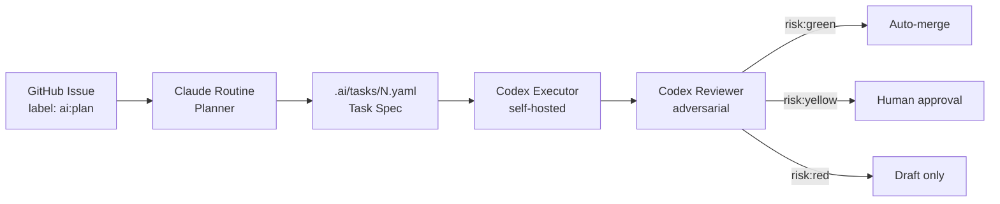

<div align="center">

# 🤖 AI Agent Delivery Pipeline

**Idea → 自动规划 → 自动实现 → 自动 Review → CI 验证 → 低风险自动合并**

[](https://github.com/alien-kai/ai-agent-delivery-pipeline)
[](https://www.anthropic.com/claude-code)
[](https://openai.com/index/openai-codex)
[](https://github.com/features/actions)
[](https://github.com/alien-kai/ai-agent-delivery-pipeline/pulls)
[](https://github.com/alien-kai/ai-agent-delivery-pipeline)

🌐 **语言**: [English](../README.md) · **简体中文**

</div>

---

## ✨ 为什么做这个 (Motivation)

LLM 编码代理很强大，但**端到端自动运行时非常脆弱**：它们会随手在整个仓库做大范围重构、跳过测试、偏离任务范围，最终合入没人完全理解的代码。多数团队的应对方式是加大人工 review 力度 —— 但这又把当初选择 AI 代理换来的速度收益抹掉了。

这个仓库是一个**带护栏的交付流水线模板**。它把 AI 代理当作同事而不是自动驾驶：每个 agent 只负责一块窄窄的职责，GitHub 充当唯一可信源和状态机，由**风险分层**决定哪些任务可以自动合并、哪些必须人工签字。

---

## 🎯 主要解决的问题 (Problems Solved)

| # | 问题 | 本流水线的应对 |
|---|------|----------------|
| 1 | 给 agent 一个模糊任务，它会做出无边界的改动 | Planner 先输出严格的 **task spec YAML**，写明 scope_in / scope_out，再开始写代码 |
| 2 | 一个模型同时规划 + 实现会自我盖章 | **双 agent 分工**：Claude 规划，Codex 实现并 review，两边互不兼任 |
| 3 | 高风险改动（认证、支付、迁移）也被自动合并 | **风险策略**把每个任务分为 `green` / `yellow` / `red`，只有 green 走自动合并 |
| 4 | Review 容易陷入风格小细节，真 bug 漏掉 | **Codex adversarial review** 带明确 P0/P1 清单（认证回归、缺测试、范围越界） |
| 5 | CI 失败时反复在 diff 周围乱改 | **CI fixer** 被要求做最小补丁，不能围绕失败做重构 |
| 6 | 缺少"谁在什么时候决定了什么"的审计链路 | 每一步都是 GitHub 的产物：issue → plan PR → impl PR → review comment → labels |

---

## 🧭 适用场景 (Where It Fits)

| 场景 | 这个模板能帮到的地方 |
|------|---------------------|
| 🧪 **独立开发者 / 小团队** 想加速迭代 side project | 一个人就能并行监管很多 green 小任务，不再频繁上下文切换 |
| 🏢 **中型产品团队** 被 lint / 文档 / 测试欠债淹没 | Green 自动合并能清理一堆没人想 review 的小修复 |
| 🔬 **AI 编码研究者** 想对比不同 planner / reviewer / executor | 每个角色都是 `.ai/prompts/` 下的一个可替换 prompt，方便做控制实验 |
| 🎓 **想学习 agent 编排的工程师** | Workflow + prompt 文件都很短、易读，且全部放在一起，没有 SaaS 绑定 |
| 🛠️ **内部平台团队** 把 agent 接到已有 CI/CD | 只用 GitHub Actions，没有额外控制面、运行时或厂商 SDK |

> ⚠️ **暂不适用**：生产关键路径、强监管环境，以及任何"不经过人就合并"会构成合规问题的地方。这些情境请只走 `yellow` / `red`。

---

## 🏗️ 架构 (Architecture)



---

## 👥 Agent 分工

| Agent | 角色 | 负责什么 | 永远不做 |
|-------|------|----------|----------|
| 🧠 **GPT Pro** | 设计时大脑 | 调 prompt、schema、风险策略、workflow | 在运行时被调用、消耗 runtime API 配额 |
| 🐙 **GitHub** | 任务队列 + 状态机 | Issues、labels、PR gate、审计日志 | 自己做决策 |
| 📋 **Claude Code Routine** | 自动 planner / decomposer | 把 issue 转成 `.ai/tasks/{issue}.yaml` | 修改生产代码 |
| ⚡ **Codex** | 自动 executor / reviewer / CI fixer | 按 spec 写代码、开 PR、review、修 CI | 推 main、越界、跳过测试 |
| ✅ **CI** | 最终裁判 | 跑 typecheck / lint / 测试 | 被绕过 |

---

## 🔄 工作流 (Workflow)

```text
GitHub Issue + label ai:plan
        ↓
  ai-plan.yml (GitHub Action)
        ↓
  Claude Code Routine API trigger
        ↓
  [AI PLAN] PR  ──▶  只包含 .ai/tasks/{issue}.yaml
        ↓
  ai-plan-automerge.yml  ──▶  spec-only 自动合并
        ↓
  ai-execute-codex.yml
        ↓
  Codex 在 feature 分支实现
        ↓
  [AI IMPL] PR
        ↓
  CI  +  ai-review-codex.yml  (Codex 对抗式 review)
        ↓
  risk:green  ──▶ 自动合并
  risk:yellow ──▶ 人工 approve
  risk:red    ──▶ 仅 draft PR
```

---

## 🚦 风险分层 (Risk Tiers)

| 层级 | 示例 | 合并策略 |
|------|------|----------|
| 🟢 **green** | 文档 · 测试 · 小 bug 修复 · lint / type 修复 · UI 文案 | CI 通过且无 P0/P1 review 问题时自动合并 |
| 🟡 **yellow** | 新 feature · API 行为变化 · 多文件重构 · 性能优化 | 自动实现，**合并前必须人工 approve** |
| 🔴 **red** | 认证 · 支付 · 权限 · 数据库迁移 · 密钥 · 隐私 · 生产部署 | **只能 plan 或 draft PR** —— 不允许自动实现 |

完整策略：[`.ai/risk-policy.md`](../.ai/risk-policy.md)

---

## 🚀 快速开始 (Quick Start)

### 1. 推送到 GitHub

```bash
gh auth login
chmod +x scripts/*.sh
./scripts/bootstrap-github.sh <owner> <repo-name> <public|private>
```

参数：

```text
第 1 个参数：GitHub owner，例如 alien-kai
第 2 个参数：repo name，例如 ai-agent-delivery-pipeline
第 3 个参数：private 或 public
```

### 2. 创建 labels

```bash
./scripts/create-labels.sh
```

### 3. 创建 Claude Code Routine

阅读 [`docs/setup-claude-routine.md`](../docs/setup-claude-routine.md)，然后把 API trigger 加到 GitHub Secrets：

```text
ROUTINE_FIRE_URL
ROUTINE_FIRE_TOKEN
```

### 4. 配置 Codex self-hosted runner

阅读 [`docs/setup-codex-self-hosted-runner.md`](../docs/setup-codex-self-hosted-runner.md)。核心命令：

```bash
npm i -g @openai/codex
codex login
```

> 💡 如果你想使用 ChatGPT subscription auth 而不是 API 计费，请**不要**在 runner 环境里设置 `OPENAI_API_KEY`。

### 5. 创建第一个 AI 任务

用 `AI Task` issue 模板创建 issue，或手动加 label：

```text
ai:plan
```

---

## 🧪 本地模式 (Claude Code + Codex Plugin)

本仓库同时支持**本地半自动模式**，适合第一次接入和 prompt 调优。

```text
/plugin marketplace add openai/codex-plugin-cc
/plugin install codex@openai-codex
/reload-plugins
/codex:setup
```

然后使用项目 slash commands：

| 命令 | 作用 |
|------|------|
| `/ai-plan <idea 或 issue#>` | 生成一个 task spec |
| `/ai-implement .ai/tasks/<id>.yaml` | 按 spec 实现 |
| `/ai-codex-review` | 对当前分支做 adversarial review |
| `/ai-codex-rescue <最高优先级问题>` | 由 Codex 修最重要的发现 |

详见 [`docs/experiment-plan.md`](../docs/experiment-plan.md) 与 [`docs/prompt-library.md`](../docs/prompt-library.md)。

---

## 🔧 需要替换的内容 (Customize)

| 文件 | 为什么改 |
|------|----------|
| [`AGENTS.md`](../AGENTS.md) | 项目真实的 install / typecheck / lint / test 命令 |
| [`CLAUDE.md`](../CLAUDE.md) | Claude routine 每次都会读到的项目上下文 |
| `.ai/prompts/*` | 每个 agent prompt 里的技术栈细节 |
| GitHub Secrets | `ROUTINE_FIRE_URL`、`ROUTINE_FIRE_TOKEN` |
| Self-hosted runner | 机器、网络策略、Codex auth |
| Branch protection | 必需 checks、限制 push 到 main |

---

## 📚 文档 (Documentation)

| 文档 | 主题 |
|------|------|
| [`docs/experiment-plan.md`](../docs/experiment-plan.md) | 从人工基线到完全自动的分阶段实验方案 |
| [`docs/prompt-library.md`](../docs/prompt-library.md) | Prompt 模板与片段 |
| [`docs/setup-claude-routine.md`](../docs/setup-claude-routine.md) | 创建 Claude Code Routine |
| [`docs/setup-codex-self-hosted-runner.md`](../docs/setup-codex-self-hosted-runner.md) | 部署 Codex runner |
| [`docs/operations.md`](../docs/operations.md) | 日常运营 |
| [`docs/security.md`](../docs/security.md) | 安全指南 |
| [`docs/workflow-smoke-test.md`](../docs/workflow-smoke-test.md) | 流水线冒烟测试 |

---

## 🤝 贡献

欢迎提 issue 和 PR，特别欢迎：

- prompt 改进
- 新的风险分层样本
- 适配其他 CI 系统的 workflow
- 来自真实使用场景的 bug 报告

大的改动建议先开 discussion。这个模板有意保持精简。

---

## 📄 License

仓库尚未声明 license。在添加之前，默认 GitHub 条款生效 —— 代码是 **source-available（可见但未授权）**，**不是真正意义上的开源**。如果希望他人能放心地使用、fork 或贡献，建议添加一个 SPDX 标准 license（MIT、Apache-2.0 等）。
